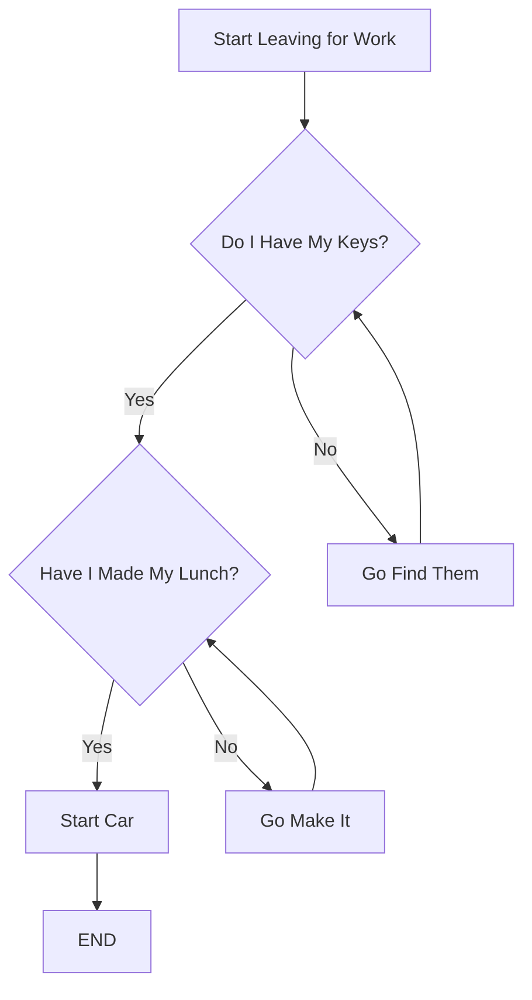

# Diagram.md




//draft 1 Error
//```mermaid

//flowchart TD

//A[Start Leaving for Work] --> B{Do I Have My Keys?}
//B -->|Yes| --> C{Have I Made My Lunch?}
//C -->|Yes| D[Start car]
//D -->[END]
//B --->|No| C[Go find them]
//C ----> B
//C -->|No| E[Go make it]
//E -----> C

// Leave for work - In order to leave for work I have a few things I need: my lunch, and my keys.
// Do I Have My Keys? - I need my car keys and house keys in order to be able to end the chain of commands.
// Have I Made My Lunch? - I need to make something to eat before I end the chain of commands. 
// Start car - I need my car keys in order to start my car to end the chain of commands. 
// My dead end "No" actions pushes instructions for me to complete the steps needed in order for me to leave for work. 
